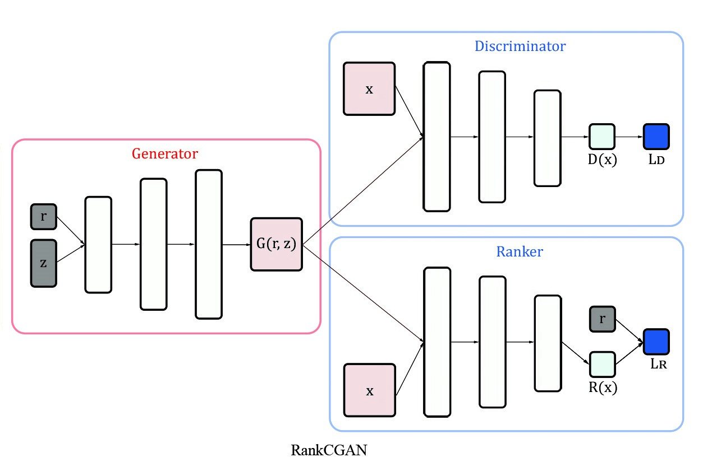
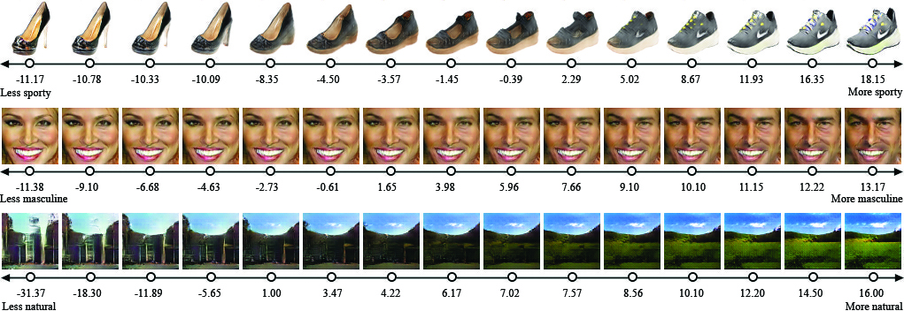
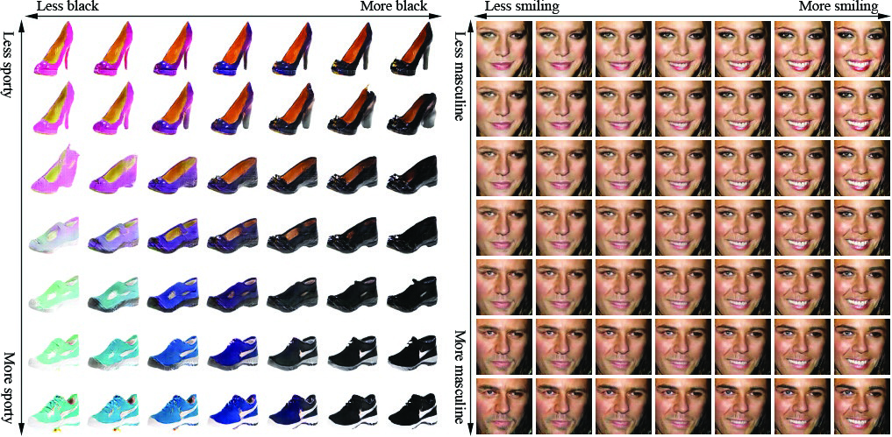

# [Ranking CGANs: Subjective Control over Semantic Image Attributes](http://bmvc2018.org/contents/papers/0534.pdf)

This repository provides PyTorch implementations for RankCGAN paper published in BMVC 2018.

This code is based on DCGAN implementation [pytorch-DCGAN](https://github.com/pytorch/examples/tree/master/dcgan).

## Model

The model architecture comprises three modules, the discriminator, generator and ranker. As shown in the following Figure:
<p align="center">

</p>

## Datasets

### Images

- [UT-Zap50K](http://vision.cs.utexas.edu/projects/finegrained/utzap50k/)
- [Pubfig](http://www.cs.columbia.edu/CAVE/databases/pubfig/)
- [OSR](http://people.csail.mit.edu/torralba/code/spatialenvelope/)

### Annotations

- [UT-Zap50K](http://vision.cs.utexas.edu/projects/finegrained/utzap50k/)
- [Pubfig](https://www.cc.gatech.edu/~parikh/attribute_feedback/)
- [OSR](https://www.cc.gatech.edu/~parikh/relative.html)

In this code, only UT-Zap50K dataset is used. For other datasets, please edit `dataloader.py` accordingly.

## Prerequisites

- Python 3.5.2
- Pytorch 0.4.0
- NVIDIA GPU + CUDA CuDNN

## Getting Started

### Installation

- Install PyTorch 0.4+ and torchvision from [http://pytorch.org](http://pytorch.org).
- Clone this repository.
```shell
git clone https://github.com/saquil/RankCGAN
cd RankCGAN
```

### RankCGAN training

The code provides two implementations. `RankCGAN.py` demonstrates one attribute conditional model and `RankCGAN_2D.py` demonstrates multiple attributes case with two attributes conditional model.

- Train a model on single attribute:

```
python3 main.py --gan_type=RankCGAN
```
- Train a model on multiple attributes:

```
python3 main.py --gan_type=RankCGAN_2D
```

### Image generation results

- 1D images generation:

<p align="center">

</p>

Generated shoe (top), face (middle), and scene (bottom) images associated with their
ranking scores using “sporty”, “masculine” and “natural” attributes respectively.

- 2D images generation:

<p align="center">

</p>

Example of two-attributes interpolation on shoe and face images using (“sporty",“black") and (“masculine",“smiling") attributes.

## Citation

If you use this code for your research, please cite our paper.
```
@inproceedings{saquil2018ranking,
  title={Ranking CGANs: Subjective Control over Semantic Image Attributes},
  author={Saquil, Yassir and Kim, Kwang In and Hall, Peter}
  booktitle={British Machine Vision Conference (BMVC)},
  year={2018}
}
```
## Poster and Supplementary Material
- You can find our BMVC 2018 poster [here](https://drive.google.com/open?id=1n8as8lVSVSWanQHDbCIH9h1tCU66msG3)
- You can find our Supplementary Material [here](http://bmvc2018.org/contents/supplementary/pdf/0534_supp.pdf)

